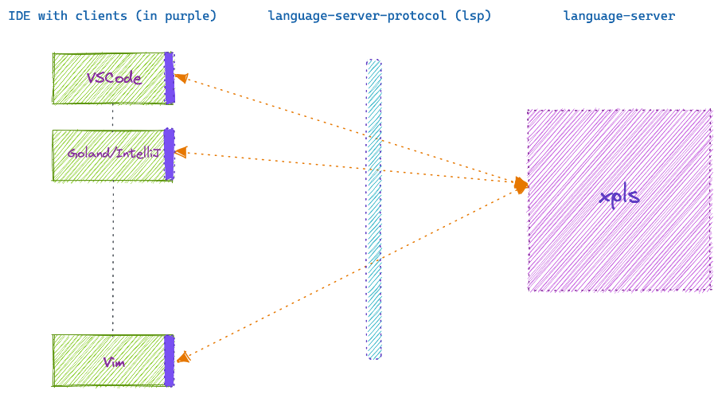

# Improving Crossplane Package Authors' Quality of Life Through Improved Tooling
* Owner: Taylor Thornton (@tnthornton)
* Reviewers: Upbound Maintainers
* Status: Draft, revision 1.0

## Background
Today, Crossplane Package (xpkg) authors face an uphill battle when it comes to
authoring packages. Things that most of us today take for granted in our 
development flow, for example:
- project initialization
- dependency management
- type suggestions (listing required fields)
- code suggestions (code hints, content assistence, code completion)
    > note: VSCode groups this under (IntelliSense)
- templates (generating test templates, file templates, etc)

are simply non-existent for xpkg authors.

> Note: various language servers available do help with some of what is called
> out above. Specifically the `yaml-language-server` helps with type suggestions
> and code suggestions for the pieces of the schemas it has access to (typically
> the top level structures of the YAML documents).

## Goals
In order to scope this down to the a tangible deliverable, the current goals are:
- provide a solution to type suggestions for the embedded resources within a 
`Composition` definition. For example:
```yaml
  resources:
    - name: rdsinstance
      base:
        apiVersion: database.aws.crossplane.io/v1beta1
        kind: RDSInstance
        spec:
          forProvider:
            region: us-east-1 # put the example down from provider, use schema for informing other fields
            dbInstanceClass: db.t2.small
            masterUsername: masteruser
            engine: postgres
            engineVersion: "12"
            skipFinalSnapshotBeforeDeletion: true
            publiclyAccessible: true
          writeConnectionSecretToRef:
            namespace: crossplane-system
      patches:
        - fromFieldPath: "metadata.uid"
          toFieldPath: "spec.writeConnectionSecretToRef.name" # autocomplete
          transforms:
            - type: string
              string:
                fmt: "%s-postgresql"
        - fromFieldPath: "spec.parameters.storageGB"
          toFieldPath: "spec.forProvider.allocatedStorage"
      connectionDetails:
        - fromConnectionSecretKey: username
        - fromConnectionSecretKey: password
        - fromConnectionSecretKey: endpoint
        - fromConnectionSecretKey: port
```
- provide a solution to code suggestions for the embedded resources within a 
`Composition` definition.
- provide a solution for generating an `openAPIV3Schema` definition for a
`CompositeResourceDefinition` (XRD) from the claim.
For example, given an example claim:
```yaml
apiVersion: database.example.org/v1alpha1
kind: PostgreSQLInstance
metadata:
  name: my-db
  namespace: default
spec:
  parameters:
    storageGB: 20
  compositionSelector:
    matchLabels:
      provider: aws
      vpc: default
  writeConnectionSecretToRef:
    name: db-conn
```
we'd generate the following schema and supply that as an auto-completion
in the `XRD`:
```yaml
schema:
  openAPIV3Schema:
    type: object
    properties:
      parameters:
        storageGB:
          type: integer
      required:
        - storageGB
    required:
      - parameters
```
> Note: it's unclear how we would be able to assert the required fields during
> schema generation (we simply don't have a hint that something is required
> vs optional). So we may start with just leaving those pieces up to the writer 
> OR we could mark every field as required and the writer could remove those
> requirements. TBD.

## Proposed Implementation
- implement a [language-server] that specifically handles the use cases described
  in the `Goals` section.
- the implementation would not look to handle use cases currently handled by other
  language servers - e.g. [yaml-language-server], yaml schema validation (Goland).
- a thin client extension would be written for the various IDEs in order to make
  them aware of the new language-server.

### High level Diagram
The following diagram describes the high level interaction between various IDE
clients and the proposed language-server using the language-server-protocol.



### Thin clients vs Thick clients
Given the fan-out that can potentially occur with the number of clients that may
need to be implemented, the current proposal is to keep the clients as thin as
possible, primarily providing the functionality to enable the given IDE to
communicate with `xpls` and minimally more.

Why?

The more functionality we place in the individual clients, the more complex they
become, the higher the cost of maintainence each one incurs.

We can't safely assume at this point in time that we will always be able to
maintain this stance; however we have a highlevel of confidence that we can with
the features we want to implement to start.


<!-----links ------->
[language-server]: https://microsoft.github.io/language-server-protocol/
[yaml-language-server]: https://github.com/redhat-developer/yaml-language-server